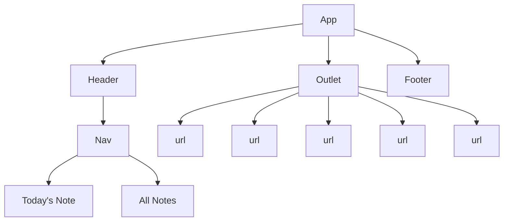

# Quotidian
<!-- Github Intro -->
Welcome to Quotidian - a full CRUD app for keeping track of your daily to-do lists. Built on a Django backend (with a postgreSQL database) and React frontend, Quotidian keeps track of all your day's to-do's, reminders, and events on a single list. A special section for all the things you've put the backburner persists throughout each note until you check it off - taking up less space in your brain, because you can rest assured you won't forget about them. With Quotidian, you'll always know exactly what you need to do and remember, everyday.

[Deployed Site](https://quotidianlists.netlify.app/)
[Backend Repo](https://github.com/cindywongdev/Project4-Quotidian-backend)

<!-- Marketing Intro -->
<!-- Welcome to Quotidian - your brain's super organized daily assistant. Stay on top of your day by keeping track of all your to-do's, reminders, and events for the day on a single note. A special section for all the things you've put the backburner persists throughout each note until you check it off - and they'll take up less space in your brain, because you can rest assured you won't forget about them.With Quotidian, you'll always know exactly what you need to do and remember, everyday. -->

#### Technologies Used

##### Backend
- Django
- Python
- PostgreSQL
- Render

##### Frontend
- Javascript
- HTML
- CSS
- SASS
- Bootstrap
- react-icons
- Netlify

#### Component Architecture

#### Frontend Route Table
|    Route     | Element |    Loader   |      Action      |                   Description                  |
|--------------|---------|-------------|------------------|------------------------------------------------|
|      /       | Index   | indexLoader |                  | Loads up all todos                             |
| /todo/:id    | Show    | todoLoader  |                  | Loads up a specific todo                       |
| /create      | Create  |             | todoCreateAction | Handle submission of a create form for todos   |
| /update/:id  | Create  |             | todoUpdateAction | Handle submission of an update form for todos  |
| /delete/:id  | Create  |             | todoDeleteAction | Handle submission of a delete form for todos   |

#### Model

#### User Stories
- As a user, I can see a list of my todos.
- As a user, I can see a specific todo.
- As a user, I can create a new todo.
- As a user, I can update a todo.
- As a user, I can delete a todo.

#### Wireframes
##### Mobile

##### Desktop

#### Daily Plan
| Date | Task |
|------|------|
| 2/21 | draft plan, create readme and frontend repo |
| 2/22 | create backend repo, full backend CRUD, deploy frontend and backend |
| 2/23 | full frontend CRUD, styling |
| 2/24 | finish responsive styling, add frontend functionality to display todos by date |
| 2/25 | add functionality to "cross out" a todo, create list model, add to route table |
| 2/26 | continue building out list model |
| 2/27 | finishing touches, practice presentation |
| 2/28 | presentation day :) |

#### Stretch Goals
- Create list model (2nd model)
- User Auth
- create functionality for users to convert reminders into todos that can be checked off

#### Future Goals
- sync with Google/Apple calender for event reminders

##### Links
Deployed Website Link
Trello Board Link
